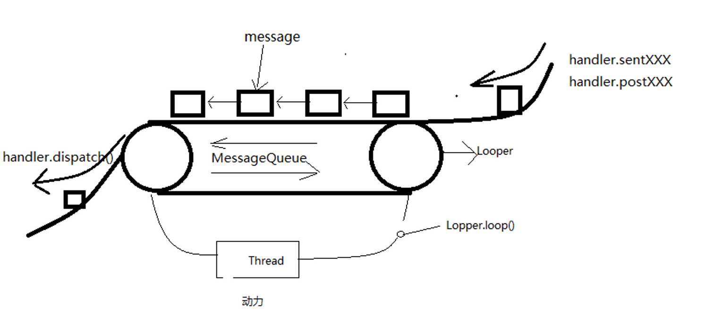

## Handler源码分析



#### handler是什么？

Android定义的一定子线程与主线程间通讯的消息传递机制。线程间通信实现是内存共享方式。

#### handler有什么用？

把子线程中的UI更新信息传递给主线程，从而完成UI更新。

#### 真的只能在主线程中更新UI吗？

子线程更新UI也行，但是只能更新自己创建的View，也就是说Android的UI更新被设计成了单线程。这样设计的目的，为了防止多线程同时更新一个UI出现的不可控错误。

#### 主线程给子线程的Handler发送消息怎么写？

主线程延时给子线程发消息。

如果不延时发送，会出现报错。原因多线程并发问题，当主线程执行发送消息时，子线程的handler还没有创建。

````java
private MyThread mThread;
public void sendMsgToChildThread() {
    mThread = new MyThread();
    mThread.start();
    mHandler.postDelayed(new Runnable() {
        @Override
        public void run() {
            mThread.getHandler().sendEmptyMessage(100)
        }
    }, 1000);
}

private class MyThread extends Thread {
        private Handler mHandler = null;
        @Override
        public void run() {
            Looper.prepare();
            mHandler = new Handler(Looper.myLooper(), new Handler.Callback() {
                @Override
                public boolean handleMessage(Message msg) {
                    if (msg.what == 100) Log.e(TAG, "子线程收到主线程的消息");
                    return false;
                }
            });
            Looper.loop();
        }

        public Handler getHandler() {
            return mHandler;
        }
    }
````


#### 为什么android中没有wait / notify方法？

handler已经把这部分功能进行了Linux层的封装

#### 为什么子线程中不可以直接new Handler()而主线程中可以？

主线程和子线程不共享同一个Looper实例，主线程的Looper在启动时就在ActivityThread#main()方法通过调用``Looper.prepareMainLooper();`` 完成初始化，通过调用 ``Looper.loop();``开启轮询，不需要手动调用。故子线程需要手动调用``Looper.prepare()``和``Looper.loop()``。

#### 为什么android开发handler来解决线程间通信

软件开发当中的最少知识原则，让开发者不需要完全了解内部原理，就能实现复杂的功能

#### 子线程发送消息给主线程，如何实现线程切换？

子线程中handler.sendMessage最后调用到MessageQueue.enqueueMessage(msg)将消息放入队列中(消息队列是一个容器，只是一个内存块没有线程区别)，主线程的looper在不断从messageQueue中取消息，最后调用handler.dispatchMessage()完成回调函数，这里回调函数是在主线程，完成了线程切换

#### 为什么Looper在handler里初始化不是直接new，而是使用prepare?  MessageQueue为什么在Looper里初始化？

为了保证handler中looper是线程唯一性。同时也可以保证一个Looper对应一个MessageQueue。

#### ThreadLocal分析(一个线程有几个Looper，如何保证？)

ThreadLocal是JDK提供用于解决线程安全的工具类，作用为每个线程提供一个独立的变量副本，以解决并发访问的冲突问题。

每个Thread内部都维护了一个 ThreadLocalMap ，ThreadLocalMap通过一个table列表来存储数据，每个数据是以key-value键值对的方式存储，其中key是当前线程ThreadLocal，value是当前线程对应的looper。根据哈希取模的方式得到当前数据存储对应表格的下标，然后以key-value的形式放入表格中。

#### 如何保证线程数据隔离：线程上下文隔离

Looper通过调用prepare()方法来初始化，prepare()方法里创建Looper并放入ThreadLocal里，并通过静态方法ThreadLocal.get()来获取，保证Looper的线程唯一性。同理MessageQueue是在Looper的构造函数中初始化，也通过静态方法来获取，保证了MessageQueue的线程唯一性。

#### handler工作流程

handler的工作流程可以看成一个传送带，传送的货物就是Message，通过handler.send类方法(sendMessage,sendMessageDelayed,sendMessageAtTime,sendEmptyMessage)和handler.post类方法(post,postdelayed,postAtTime)最终都会调用messgeQueue.enqueueMessage将消息一个一个放在传送带上形成一个单链表优先级队列(MessageQueue)，Looper.loop()相当于传送带电源，不断的调用MessageQueue.next()获取消息，最后交给handler.dispatchMessage()处理消息。

####  MessageQueue的阻塞机制(为什么主线程loop死循环不会引起ANR？

####  Looper是如何对消息队列排列和分发？)

looper死循环通过MessageQueue#next方法不断获取message，MessageQueue会根据线程执行时间的先后进行排序，获取时会判断当前message执行时间是否到，如果到了返回message调用handler#dispatchMessage()处理消息。如果没有到(或者当前队列为空)设置mBlocked阻塞标志位为true，然后调用nativePollOnce()阻塞直到message执行时间再返回`(当消息队列为空时也会阻塞)`，此时阻塞线程会进入休眠并释放CPU时间片(通过native层实现)，故不会引起ANR。

线程等待如何唤醒，在looper#enqueueMessage()中当前消息队列为空或有需要执行消息，但mBlocked标志位为true，说明当前线程在等待状态会调用nativeWake()方法进行线程唤醒。

这种机制是Linux的epoll机制。

#### 为什么建议使用Message.obtain()来创建Message实例？

obtain()内部实现逻辑为判断Message池是否为空，不为空取出一个Message对象，池容量-1，返回message，否则创建一个新Message对象。内部使用享元模式，设计了一个容量大小为50的Message池单链表结构，避免重复创建多个实例对象，节约内存。

#### handler共享内存的实现原理(Message链表原理与重用机制是怎么实现？)

使用享元模式的设计模式，主要实现是在Message#recycleUnchecked()方法中，当Message被Looper分发完成后，会调用recycleUnchecked()方法，回收没有在使用的message。将message的所有数据清空，标记flags为FLAG_IN_USE，并放入sPool的队列中。使用Spool队列数据在Message#obtain()方法中，从sPool队首中取出一个空Message，清空标志位flags使用，从而实现内存共享。定义sPool队列最大为MAX_POOL_SIZE = 50

优点：可以减少内存碎片，减少GC，防止申请大块内存时应用OOM。因为GC只有在内存不够时才会执行，GC会导致应用短暂停顿，故代码层次需要尽可能减少内存的开销

#### Looper什么时候退出？

当在子线程创建handler，需要调用Looper.quit()方法退出。主线程只要应用在运行就会一直循环运行，除非应用退出。

#### 子线程维护的Looper消息无队列处理方案是什么？有什么用？

调用looper.quit()方法退出。

#### Handler泄露的原因及正确的写法

如果在Activity中初始化一个Handler对象，会有如下警告`this handler class should be static or leaks might occur`。

原因是：java中非静态内部类会持有Activity的引用从而导致Activity无法正常GC。

解决办法：将handler变成静态内部类，但静态内部类是不能调用Activity内部非静态变量，故可以加上弱引用持有外部Activity来实现。

````java
private static class myHandler extends Handler {
	private final WeakReference<MainActivity> content;
    
    private MyHandler(MainActivity content) {
        this.content = new WeakReference<MainActivity>(content);
    }
}
````

为什么其他内部类没有内存泄漏的问题？

MessageQueue持有了Message，Message持有了Handler，Handler持有了Activity，故当Activity销毁时并不能正常GC，导致了内存泄漏。其他内部类并没有被另外对象持有，在Activity销毁时可以正常GC。


#### 可以有多个handler往MessageQueue中放消息，MessageQueue如何保证线程安全？

使用synchronized锁。内置锁(由JVM自动完全)。

一个线程只有一个Looper可以处理MessageQueue，故使用synchronized(this)来同步锁可以保证线程安全。

所以MessageQueue的next()和enqueueMessage()都需要加锁。

#### 同步屏障

顾名思义，同步屏障就是阻碍同步消息，只让异步消息通过。 UI 更新相关的消息即为异步消息，需要优先处理。

 

#### IntentService


#### MessageQueue.IdleHandler解析

[详情解析](https://wetest.qq.com/lab/view/352.html)

````java
Idle接口接口
public static inerface IdleHandler {
	boolen queueIdle();
}
````

主要功能：在looper里面message暂时处理完时会回调接口，返回false会移除监听，返回true在下次message处理完时继续回调。

使用场景：

1. 提供一个android没有的生命周期回调

   Activity的生命周期onStart()是用户可见时回调，onResume()是用户可交互时回调，没有一个activity绘制完成回调接口。

   onResume()代码优先于measure等绘制流程执行，故在onResume里调用不行，measure，layout，draw都是通过message调用的，故当页面绘制流程结束时会回调IdleHandler接口。

   

   可以对页面内容比较复杂，处理页面显示数据比较耗时，会出现先显示一个空白页面再出现页面内容的情况进行优化。

   ````java
   Looper.myQueue().addIdleHandler(new MessageQueue.IdleHandler(){
       @Override
       public boolean queueIdle() {
           // 这里可以执行耗时页面绘制操作
           // 优化效果是页面不需要耗时处理的部分会先显示，再等待数据填充完成显示剩余页面
           return false;
       }
   })
   ````

   

2. 可以结合handlerThread，用于单线程消息通知器

   当我们的页面数据源来自多个线程，就会有可能页面数据会连续快速改变，从而UI也会快速刷新。我们可以优化成只需要对最后一次回调刷新UI。