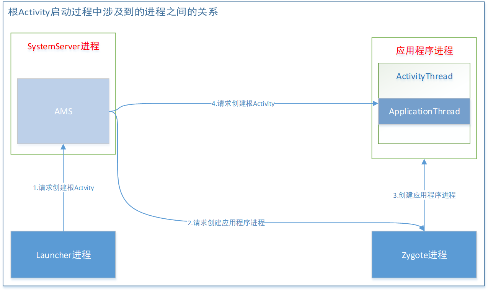

# 描述一下Activity启动过程

#### 简述Activity的启动流程

1. 点击桌面App图标，Launcher进程使用Binder IPC向system_server进程发起startActivity请求
2. system_server进程接收到请求后使用socket向zygote进程发送创建进程的请求
3. zygote进程fork出新的子进程，即App进程
4. App进程通过Binder IPC向system_server进程发起attachApplication请求（）
5. system_server进程在收到请求后，在完成准备工作后通过Binder IPC向App进程发送scheduleLauncheActivity请求
6. App进程的ApplicationThread收到请求后，通过handler向主线程发送H.LANCH_ACTIVITY消息（在android8之后的版本变为发送H.EXECUTE_TRANSACTION消息）
7. 主线程在收到Message后通过反射机制创建目标Activity，并回调onCreate等方法
8. 到此App便正式启动，开始进入Activity的生命周期，执行完onCreate/onStart/onResume方法，UI渲染完成后便可以看到App。

Activity的启动过程，我们可以从Context的startActivity说起，其实现是ContextImpl的startActivity，然后内部会通过Instrumentation来尝试启动Activity，它会调用ams的startActivity方法，这是一个跨进程过程，当ams校验完activity的合法性后，会通过ApplicationThread回调到我们的进程，这也是一次跨进程过程，而applicationThread就是一个binder，回调逻辑是在binder线程池中完成的，所以需要通过Handler H将其切换到ui线程，第一个消息是LAUNCH_ACTIVITY，它对应handleLaunchActivity，在这个方法里完成了Activity的创建和启动。

大概可以分成四个步骤

1. 应用程序进程创建到应用程序启动过程

   * AMS发送启动应用程序进程请求到Zygote

   

   * Zygote接收请求并fork应用程序进程，启动程序并执行Application生命周期

   

   首先通过 Launcher 中的点击事件触摸手机屏幕中的应用图标，AMS获取需要创建应用信息(用户ID，)通过Socket连接传递给Zygote进程请求创建应用程序，Zygote进程收到传递信息进行native层创建进程，通过反射调用ActivityThread#main函数，最近ActivityThread#attach函数中通过反射实例化Application并执行对应生命周期。

2. 应用程序根Activity启动 

   * 从Launcher图标点击启动应用程序，Launcher请求AMS过程

   

   当我们点击应用图标的时候会调用Launcher的startActivitySafely函数，为要启动的Activity添加Intent.**FLAG_ACTIVITY_NEW_TASK**的Flag并调用Activity的startActivity函数，内部经过逻辑处理会调用Instrumentation(主要用来监控应用程序和系统的交互)的execStartActivity 函数，这里通过ActivityManager.getService()通过IActivityManagerSingleton单例的get函数(这边因为使用的单例可以做为插件化处理的hook点)获取AMS的代理对象IActivityManager.aidl，完成Launcher进程和AMS(SystemServer进程)的Binder通信。

   * 应用内部调用startActivity启动页面，则不需要上一步操作

   

   应用内启动Activity不需要Launcher进程交互，直接应用程序与AMS交互。

   调用Context#startActivity()，context实现是ContextImpl，其实就是调用ContextImpl#startActivity()，这里面就通过ActivityThread#getInstrumentation()获取Instrumentation再调用execStartActivity函数，后面流程就和上面一样了。

   * AMS调用ApplicationThread过程

   

   主要是在ActivityStarter中创建ActivityStack并与Activity关联，还会创建一个新的TaskRecord，用来描述当前Activity的任务栈，然后在ActivityStackSupervisor内部主要用来管理不同的Stack，如果判断当前启动Activty所在进程没有运行，AMS会通过Socket通知Zygote创建一个新的进程。最后AMS(SystemServer进程)通过ApplicationThread来与应用程序进程进行Binder通信**(这里Android7和android8之后实现不同，Android7直接调用IApplicationThread的scheduleLaunchActivity，通过Binder通信直接到ApplicationThread的scheduleLaunchActivity函数中，Android8之后通过封装一个ClientTransaction里面有ClientTransactionItem列表，列表中可以根据不同生命周期存放不同item，通过IApplicationThread#scheduleTransaction完成AMS和ApplicationThread的Binder通信)**。到这里应用启动准备工作已经完成，需要通知应用程序进程完成应用启动。

   * ActivityThread启动Activity过程

   

   这里ApplicationThread是通过handler的不同标志位去执行ActivityThread的不同方法**(这里Android7和Android8之后实现不同，Android8之后将7当中一些关于activity生命周期(100-106)合并成一个159EXECUTE_TRANSACTION，主要是为了方便扩展和实现lifecycle的功能)**，最后都会调用到ActivityThread#performLaunchActivity函数当中，拿到启动 Activity 组件 Component 的信息,通过 Instrumentation 类的 newActivity 函数()，内部是通过 ClassLoader 的 loadClass 实例化了 Activity, 拿到 Application 进行与 Activity 绑定，最后调用 Instrumentation 函数的 callActivityOnCreate 执行了 Activity#onCreate 生命周期

3. WindowManager如何管理Activity展示页面内容到手机屏幕

   在调用ActivityThread#performLaunchActivity()函数之前会调用ActivityThread#handleLaunchActivity()函数，会调用WindowManagerGlobal.initialize()进行窗口初始化准备。然后在performLaunchActivity()中会调用Activity#attach()函数中创建PhoneWindow，然后通过setWindowManager方法与WMS关联起来。再通过onCreate内部调用setContentView()函数会创建DecorView(本质FrameLayout)，完全页面布局的加载，但这时Activity在后台没有显示出来。然后会调用ActivityThread#handleResumeActivity()函数这里会调用Activity#onResume生命周期，再通过ViewManager#addView()，最终会通过Binder通信调用WMS#addWIndow，WMS负责界面显示的是Surface。WMS会将它所管理的Surface交由SurfaceFlinger处理，SurfaceSlinger会将Surface绘制在屏幕上，最将Activity显示在屏幕上。

延展话题

如何hook一个Activity启动实现打开没有注册的Activity

或 插件化实现原理

简述打开过程：

应用程序进程调用startActivity通知AMS进程，AMS进程进行Activity校验，创建ActivityRecord放入Task栈中，再通知应用程序ApplicationThread来完成创建Activity页面并展示到屏幕上。

思路：

当应用程序通知AMS进程时，我们在这里把请求跳转未注册Activity的intent内部替换成一个已注册的Activity，从而完成检验工作。再AMS通知应用程序ApplicationThread时把刚刚替换掉的intent信息再更改成请求未注册的Activity信息，从而骗过系统完成未注册Activity的打开。

hook点的选择：

1. 应用程序通知AMS进程时选择Instrumentation#execStartActivity()函数，应用程序内部启动activity和初始化应用启动根Activity都会调用这个方法，该方法内部都是通过单例方式获取IActivityManager接口调用startActivity方法，单例和接口形式非常适合进行hook，系统创建完单例之后基本不会发生变化，故将hook点选择在这里。
2. AMS通知ApplicationThread是在ActivityThread通过handler调用handleLaunchActivity()函数展示页面。一个应用ActivityThread进程只有一个，handler实例mH是全局变量，这样也非常适合进行hook。

#### AndroidManifeset.xml中没有定义的activity，运行时报错，是怎么做的？
